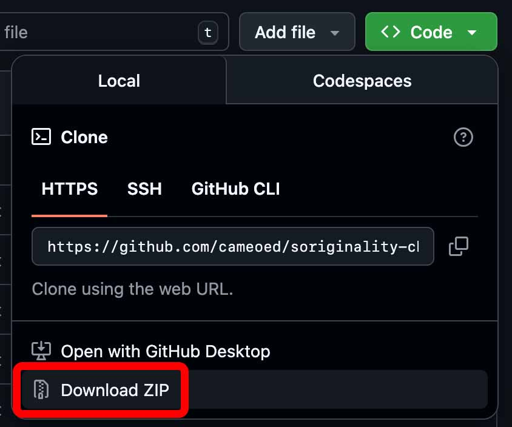

# Soriginality Checker

**Verifies the originality of Sora videos using Google Lens.**

Soriginality Checker intercepts high-resolution thumbnails from Sora Profile or Post views and instantly reverse searches them via SerpAPI to detect re-uploads, exact matches, and sources across the web.

### Key Features

* **Automatic Interception:** Captures HQ thumbnails from Sora's internal network traffic.
* **Google Lens Integration:** powered by SerpAPI to find visual matches on YouTube, TikTok, etc.
* **Feed & Post Support:** Works on both Profile pages and Post pages.
* **CSV Export:** Download a report of all findings (way more than what is displayed!)

---

### Prerequisites

You need a **SerpAPI Private Key** (Free tier allows 250 searches/month).

1. Register at [SerpAPI.com](https://serpapi.com/).
2. Copy your API Key from the dashboard.

---

### Installation

1. Download zip of this repository, unzip the folder.
2. Open Chrome and navigate to `chrome://extensions/`.
3. Enable **Developer mode** (top right).
4. Click **Load unpacked** and select this folder.
5. Pin the extension to your topbar

---

### How to Use

1. Navigate to [sora.chatgpt.com](https://sora.chatgpt.com/).
2. Click the **Soriginal** icon to open the Side Panel.
3. **Config:** Paste your SerpApi API Key in the bar. Toggle *Strict Mode* for exact matches only.
4. **Scan:** Click **Start**.
* *Profile Feed:* Page will auto-refresh. You can then scroll to queue new videos.
* *Post:* The page will auto-refresh to capture data.

5. **Export:** Click **Save Results** to download FULL findings (tons of links) as csv.

> **Privacy Note:** Your API key is stored in your browser's local storage and is sent only to SerpAPI. This runs fully locally.
